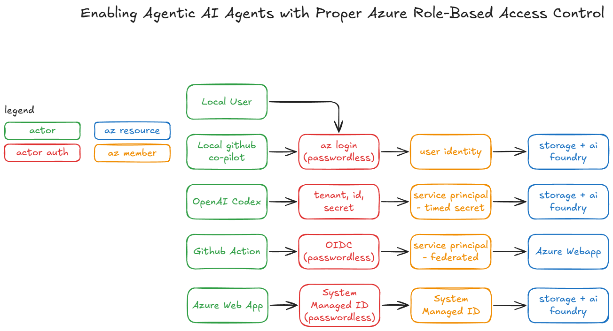
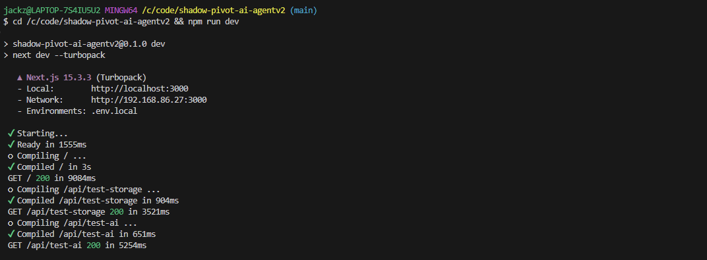
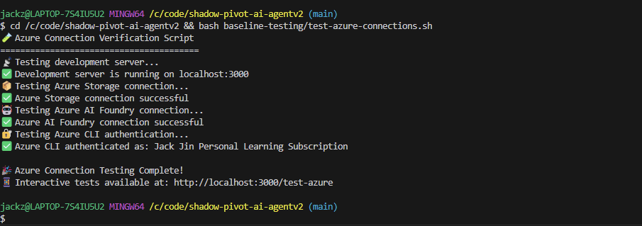
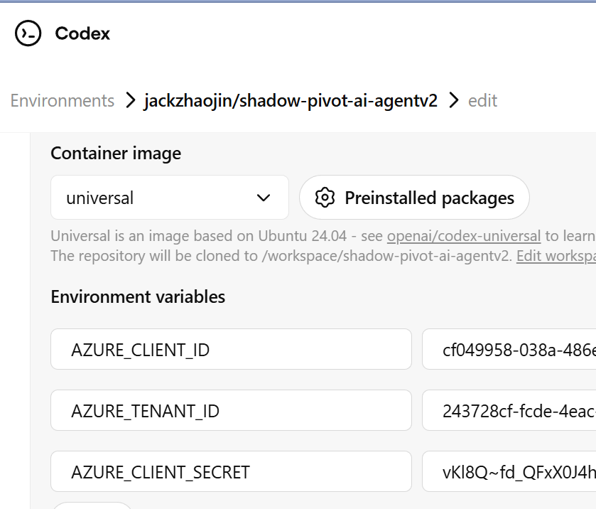

*This blog is part of a series documenting my journey building a real, working public facing AI agent NextJS application without writing a single line of code myself. Every line of code and test automation is generated by AI. I focus on planning, markdown specs, and testing. The goal is to push my understanding of agentic AI systems, deployed securely on Azure, with proper DevOps and role-based access. I’m not an expert in cloud auth or agent frameworks, but it's been great fast and sharing everything along the way.*

*You can follow the project and source code here: [github.com/jackzhaojin/shadow-pivot-ai-agentv2](https://github.com/jackzhaojin/shadow-pivot-ai-agentv2)
Live test version: [shadow-pivot-ai-agentv2-fpfzhqgyeqdpdwce.eastus2-01.azurewebsites.net](https://shadow-pivot-ai-agentv2-fpfzhqgyeqdpdwce.eastus2-01.azurewebsites.net/) (container hosted on a free Azure plan. Might take a moment to wake up)*

# Enabling Agentic AI Agents with Azure Proper Role-Based Access Control

If your agents can't test, they can't build. It's that simple.

In this post, I walk through how I enabled four actors in my AI project to securely access Azure resources:

* Myself, developing locally
* GitHub Copilot, assisting in my local environment
* Azure Web App, hosting the application
* OpenAI Codex, generating and validating code via pull requests
* GitHub Actions, compiling and deploying code with passwordless OIDC authentication for full CI/CD enablement

Each of these uses a distinct Azure authentication pattern. But all follow one goal: enablement. For AI to be effective, it needs access to real environments, just like any developer would. That means cloud resources, data stores, and permissioned APIs. This blog is about setting up the scaffolding to make that possible, one auth pattern at a time.

# Local Authorization (Me + GitHub Copilot)

Local development is where it all begins. And for me, it's not just about me as a human developer. GitHub Copilot runs alongside me, inside the same VS Code terminal, using the same authentication context.

That context comes from a single, powerful command: `az login`.

When you run `az login`, Azure CLI authenticates you via a browser prompt and stores a secure access token on your machine. This token is then accessible by Node.js applications (like mine) through Azure's **default credential chain**. Specifically, the Azure SDKs use `DefaultAzureCredential`, which tries multiple credential sources in order. Since `az login` sets a CLI-based credential, it becomes the active context for any Azure SDK code running locally - including code suggested and executed by GitHub Copilot.

So when I type `npm run dev`, my development server has all it needs to access Azure Storage or AI Foundry. Securely and passwordlessly.

AI agent can also type npm run dev as well, in case you don't want to.

Below is a screnshot of AI working locally against AI. This is a different blog but **test driven development** needs to be part of every AI agent driven product. They will do all the work, all you have to do is ask nicely.

This pattern works because Azure CLI integrates tightly with the SDKs. And more importantly, it allows GitHub Copilot to generate and run cloud-interactive code without exposing or managing credentials directly.

Through the Azure Portal, I assigned my account the **Contributor** role to:

* My Azure Blob Storage account
* My AI Foundry instance

In a real project most likely groups should be assigned to roles not users directly.

# Azure Managed Identity (Web App → Storage & Foundry)

In production, my Azure Web App needs to interact with the same services: Blob Storage and AI Foundry. But it can't rely on my local login. This is where Azure's **System Assigned Managed Identity** comes in.

This identity acts as the "user" for the web app. Through the Azure Portal, I assigned it the **Contributor** role to:

* My Azure Blob Storage account
* My AI Foundry instance

No keys. No passwords. Just native RBAC.

This is Azure at its best: services talking to services using built-in identities and scoped permissions. It keeps the surface area minimal and the setup clean. I configured all of this manually in the Azure Portal for speed. No Infrastructure as Code yet.

# Codex with Scoped Service Principal

Codex is new. It doesn’t yet support managed identity or OIDC out of the box. I had originally hoped to implement a fully passwordless authorization architecture, but this is where I had to make an exception.

That meant falling back to Azure’s most universal option: a **Service Principal with a secret**.

This pattern has been around for years. It’s not glamorous, but it works.

For Codex to validate its own code - say, by calling into Blob Storage or pinging an AI endpoint - I created a service principal and granted it the **Contributor** role, just like my Web App’s managed identity.

The secret is not stored in `.env` or written to disk. It’s passed via **environment variable injection**, scoped tightly, and rotated using Azure's built-in secret expiration timers. Codex uses it to make secure API calls during validation steps, and yes, it works. I plan to share pull request examples where Codex self-verifies its own contributions.

Is it perfect? No. But it's a huge leap toward secure, autonomous AI dev workflows.

# GitHub Action with OIDC for CI/CD

Once code is written - by me, Copilot, or Codex. I want it deployed quickly and securely. That’s where GitHub Actions and Azure’s **OpenID Connect (OIDC)** support shine.

Here’s the pattern:

* I created an **Enterprise Application** in Azure.
* Mapped it to a **Service Principal**.
* Configured a **Federated Credential** for GitHub.

On every `main` branch push:

* GitHub builds the latest image and pushes it to GitHub Container Registry.
* OIDC auth is used to log into Azure.
* The Web App is restarted, which pulls the new container image.

Please see my github agent deployment action which uses this oidc pattern https://github.com/jackzhaojin/shadow-pivot-ai-agentv2/blob/main/.github/workflows/main_shadow-pivot-ai-agentv2.yml

At this stage, I’m only pushing the latest build. No multi-stage conversion or additional image optimization yet. No secrets. No password storage. All clean, repeatable, and secure.

It's worth nothing that I'm skipping quite a bit of Dev Ops and CI/CD setup, and focusing more of this blog on authorization with AI Agents.

I’ll link to the GitHub Action snippet for those who want to see how it’s wired. The only caveat? On Azure’s free plan, web apps can be a little slow to wake up. That’s the tradeoff.

# Tying It All Together

This was a lot of effort to figure out, but it was so much fun. Authentication and authorization was something I was not good at, and now I'm better. Here’s a composite visual and cheat sheet summarizing the four actor patterns:

| Actor          | Auth Method                | Azure Role  | Resources Accessed             | Notes                            |
| -------------- | -------------------------- | ----------- | ------------------------------ | -------------------------------- |
| Me (Local)     | `az login` CLI token       | Contributor | Storage, AI Foundry            | CLI stores secure token          |
| GitHub Copilot | Inherits CLI context       | Contributor | Same as above                  | Runs via local Node context      |
| Azure Web App  | Managed Identity (System)  | Contributor | Storage, AI Foundry            | RBAC set via Azure Portal        |
| Codex          | Service Principal + Secret | Contributor | Storage, AI Foundry            | Env var injected manually        |
| GitHub Action  | OIDC + Federated Cred      | Contributor | Restart Web App (trigger pull) | Zero secrets, 100% CI/CD enabled |

If AI can’t test, it can’t code. That’s the baseline.

Every one of these patterns exists to unblock the AI from being a real, effective team member. In this project, I write 0% of the code. So enabling AI to test, validate, and deploy is not optional. It’s foundational.

AI agents need to be enabled like human developers. If they can’t access the data store or the AI Foundry models, they won’t be able to contribute meaningfully. They’ll be confused. Slowed down. And unproductive.

This is just the beginning. My GitHub repo shows a lot more progress than what’s written here. Hopefully, I’ll find the time and energy to keep sharing as the journey unfolds.
